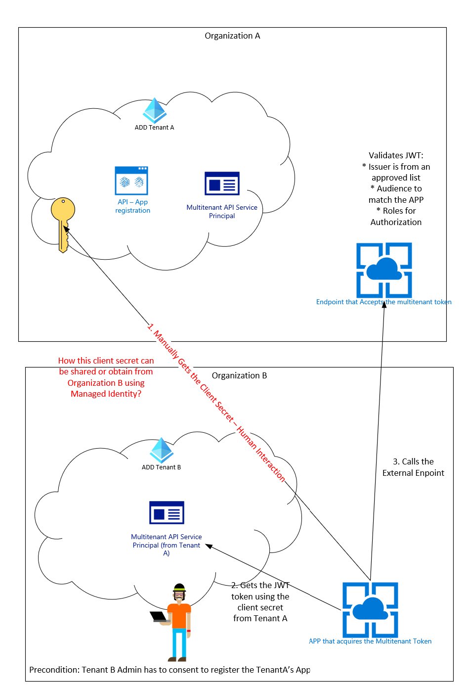
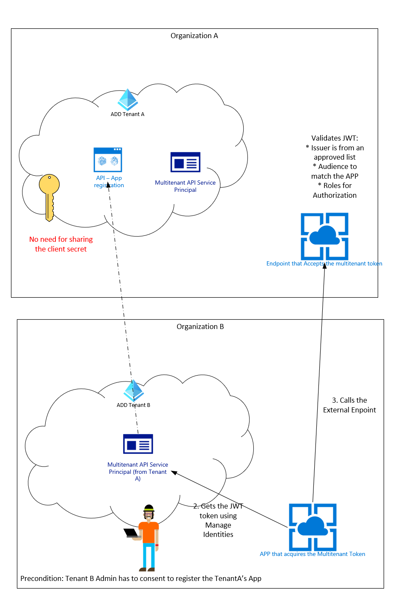
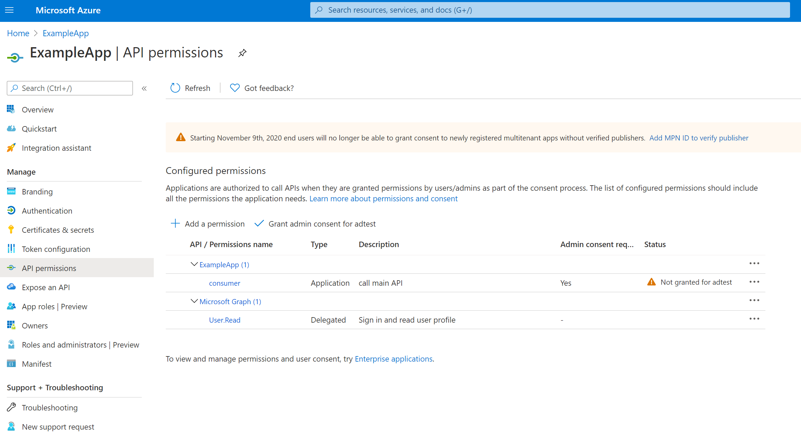

# AAD-Multitenant-APIs-w-Managed-Identities
This project includes a working example on how to setup and run a service to service authentication using OAuth v2 client credential flow, on a multi-tenant set up without the need to share any client secret, but using Managed Identities in Azure.

## Content
* Preconditions
* Multitenant SetUp

** Create main App in Tenant A
** Authorized main App in Tenant B
* Terraform Deployments enabling MI
* Java Code to get MI Access token

## Apps
### Basic API that validates JWT
Basic asp.net core API template that uses Microsoft.AspNetCore.Authentication.JwtBearer library to validate JWT tokens. 
URL https://nicojkwebapi2.azurewebsites.net/weatherforecast

## Azure Function calling the API that enables Managed Identity to get the access token

## AAD Tenants
### Main Tenant - API Multitenant APP
1. Run the main_aad_tenant_app.tf within the main_terraform folder, to provision the main app registration in the AAD tenant. Make sure you perform a terraform init and an az login to the desired ad tenant. Because of terraform limitations https://github.com/hashicorp/terraform/issues/23966 you will have to first perform a terraform apply before assigning the mainAppId and app_role_id variable names and the run a second terraform apply to have terraform assigning the correct required_resource_access profiles

2. After the app has been registered, have the tenant admin manually give admin consent on the custom role in the azure portal 

### Second Tenant - Consumer API Tenant
It includes a Service Principal that's linked to the Main API app registration. It does not have a client secret.
It includes another Service Principal automatically created to be used by the Azure Function deployed in the Azure subscription linked to the this consumer API Tenant

3. Invoke this URL to register and trust the Multitenant App in the second tenant  https://login.microsoftonline.com/{secondTenandID}/v2.0/adminconsent?client_id={APP_IP}&redirect_uri={redirect_URI}&scope=openid+profile

4. Then submit another request with the actual Multitenant API scope using this format https://login.microsoftonline.com/{secondTenandID}/v2.0/adminconsent?client_id={APP_IP}&redirect_uri={redirect_URI}&scope={APP ID}/.default, this way the APP will be register with the whole scope of permissions from the main tenant in the secondary tenant.
